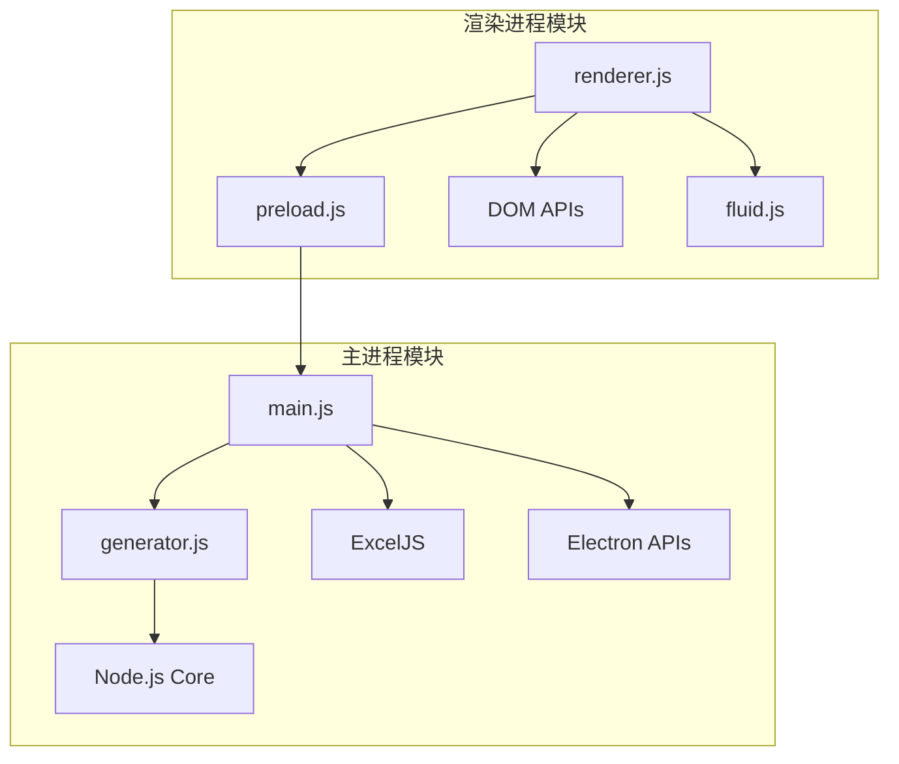

# 模块化和可扩展性分析 (Modularity & Extensibility Analysis)

本文档分析 ZTE uSmartView LLD Generator 项目的模块化设计、耦合度和可扩展性。

---

## 1. 模块架构分析

### 1.1 模块依赖图



### 1.2 模块职责矩阵

| 模块 | 主要职责 | 依赖模块 | 被依赖模块 | 耦合度 |
|------|----------|----------|------------|--------|
| main.js | 应用生命周期、IPC处理 | generator.js, ExcelJS | preload.js | 中 |
| generator.js | 核心业务逻辑 | Node.js Core | main.js | 低 |
| renderer.js | UI交互逻辑 | preload.js, DOM | 无 | 低 |
| preload.js | 安全通信桥梁 | Electron IPC | renderer.js | 低 |
| fluid.js | 视觉效果 | Canvas API | renderer.js | 低 |

---

## 2. 耦合度分析

### 2.1 模块间耦合评估

**低耦合模块 (✅ 优秀):**
- **generator.js**: 纯函数设计，无外部依赖
- **fluid.js**: 独立的视觉效果模块
- **preload.js**: 单一职责，仅负责IPC桥接

**中等耦合模块 (🟡 可接受):**
- **main.js**: 依赖多个模块，但职责明确
- **renderer.js**: 依赖DOM和preload，但逻辑清晰

**高耦合模块 (🔴 需要关注):**
- 暂无高耦合模块

### 2.2 数据流分析

**单向数据流设计:**
```
用户输入 → renderer.js → preload.js → main.js → generator.js → 结果返回
```

**优点:**
- 数据流向清晰，易于调试
- 避免循环依赖
- 便于单元测试

### 2.3 接口设计评估

**API接口质量:**

1. **generator.js 接口**
   ```javascript
   // ✅ 良好的函数式接口
   function generatePlan(params) {
     // 纯函数，无副作用
     return { servers, vms, storagePlan, summary };
   }
   ```

2. **preload.js 接口**
   ```javascript
   // ✅ 最小化暴露原则
   contextBridge.exposeInMainWorld('electronAPI', {
     generateExcel: (params) => ipcRenderer.invoke('generate-excel', params)
   });
   ```

3. **IPC通信接口**
   ```javascript
   // ✅ 类型安全的事件通信
   ipcMain.handle('generate-excel', async (event, params) => {
     // 处理逻辑
   });
   ```

---

## 3. 可扩展性评估

### 3.1 水平扩展能力

**当前支持的扩展点:**

1. **新的虚机类型**
   - 在generator.js中添加新的虚机配置
   - 修改虚机生成逻辑

2. **新的网络场景**
   - 扩展scene参数选项
   - 添加对应的IP分配策略

3. **新的存储策略**
   - 扩展storageSecurity选项
   - 实现新的存储规划算法

**扩展难度评估:**
- 🟢 **容易**: 添加新的虚机规格、IP范围格式
- 🟡 **中等**: 添加新的网络场景、存储策略
- 🔴 **困难**: 修改核心架构、添加新的输出格式

### 3.2 垂直扩展能力

**性能扩展潜力:**

1. **计算密集型优化**
   ```javascript
   // 当前: 同步处理
   for (let i = first; i <= last; i++) {
     ips.push(intToIp(i));
   }
   
   // 优化: 异步批处理
   async function generateIpsBatch(first, last, batchSize = 1000) {
     // 分批处理大量IP
   }
   ```

2. **内存优化**
   - 使用流式处理大量数据
   - 实现IP地址生成器模式

3. **并发处理**
   - 多进程处理不同模块
   - Worker线程处理计算密集任务

---

## 4. 架构改进建议

### 4.1 短期改进 (1-2周)

**1. 配置外部化**
```javascript
// 建议: 创建 config/ 目录
config/
├── vm-specs.json      // 虚机规格配置
├── network-scenes.json // 网络场景配置
└── storage-policies.json // 存储策略配置
```

**2. 错误处理标准化**
```javascript
// 建议: 创建统一的错误类
class LLDGeneratorError extends Error {
  constructor(code, message, details) {
    super(message);
    this.code = code;
    this.details = details;
  }
}
```

**3. 日志系统**
```javascript
// 建议: 添加结构化日志
const logger = require('./utils/logger');
logger.info('开始生成规划', { userCount, scene });
```

### 4.2 中期改进 (1个月)

**1. 插件架构**
```javascript
// 建议: 支持插件扩展
class PluginManager {
  registerPlugin(name, plugin) {
    this.plugins.set(name, plugin);
  }
  
  executeHook(hookName, data) {
    // 执行所有插件的钩子函数
  }
}
```

**2. 数据验证层**
```javascript
// 建议: 使用JSON Schema验证
const Ajv = require('ajv');
const schema = require('./schemas/input-params.json');
const validate = ajv.compile(schema);
```

**3. 缓存机制**
```javascript
// 建议: 缓存计算结果
class PlanCache {
  get(paramsHash) {
    return this.cache.get(paramsHash);
  }
  
  set(paramsHash, plan) {
    this.cache.set(paramsHash, plan);
  }
}
```

### 4.3 长期改进 (3个月)

**1. 微服务架构**
```
┌─────────────────┐    ┌─────────────────┐
│   UI Service    │    │  Plan Service   │
│  (Electron)     │◄──►│   (Node.js)     │
└─────────────────┘    └─────────────────┘
                              │
                              ▼
                       ┌─────────────────┐
                       │ Export Service  │
                       │   (Node.js)     │
                       └─────────────────┘
```

**2. 数据库支持**
```javascript
// 建议: 支持配置持久化
class ConfigRepository {
  async saveTemplate(name, config) {
    // 保存配置模板
  }
  
  async loadTemplate(name) {
    // 加载配置模板
  }
}
```

**3. API化**
```javascript
// 建议: 提供REST API
app.post('/api/v1/generate-plan', (req, res) => {
  const plan = generatePlan(req.body);
  res.json(plan);
});
```

---

## 5. 设计模式应用

### 5.1 当前使用的设计模式

**1. 策略模式 (Strategy Pattern)**
```javascript
// IP分配策略
const ipStrategies = {
  cidr: parseCidr,
  range: parseRange,
  list: parseList
};
```

**2. 工厂模式 (Factory Pattern)**
```javascript
// 虚机创建工厂
function createVM(type, config) {
  switch(type) {
    case 'management': return new ManagementVM(config);
    case 'compute': return new ComputeVM(config);
    default: throw new Error('Unknown VM type');
  }
}
```

**3. 观察者模式 (Observer Pattern)**
```javascript
// IPC事件机制
ipcMain.handle('generate-excel', handler);
```

### 5.2 建议引入的设计模式

**1. 建造者模式 (Builder Pattern)**
```javascript
// 复杂配置构建
class PlanBuilder {
  setNetworkConfig(config) { /* ... */ return this; }
  setServerConfig(config) { /* ... */ return this; }
  setStorageConfig(config) { /* ... */ return this; }
  build() { return new Plan(this.config); }
}
```

**2. 装饰器模式 (Decorator Pattern)**
```javascript
// 功能增强
class CachedGenerator {
  constructor(generator) {
    this.generator = generator;
    this.cache = new Map();
  }
  
  generatePlan(params) {
    const key = JSON.stringify(params);
    if (this.cache.has(key)) {
      return this.cache.get(key);
    }
    const result = this.generator.generatePlan(params);
    this.cache.set(key, result);
    return result;
  }
}
```

**3. 责任链模式 (Chain of Responsibility)**
```javascript
// 验证链
class ValidationChain {
  constructor() {
    this.validators = [];
  }
  
  addValidator(validator) {
    this.validators.push(validator);
    return this;
  }
  
  validate(params) {
    for (const validator of this.validators) {
      const result = validator.validate(params);
      if (!result.valid) {
        throw new Error(result.message);
      }
    }
  }
}
```

---

## 6. 可维护性指标

### 6.1 代码复杂度

| 模块 | 圈复杂度 | 认知复杂度 | 维护性指数 | 评级 |
|------|----------|------------|------------|------|
| generator.js | 15 | 12 | 65 | 🟡 中等 |
| main.js | 8 | 6 | 75 | 🟢 良好 |
| renderer.js | 10 | 8 | 70 | 🟢 良好 |
| preload.js | 2 | 1 | 90 | 🟢 优秀 |

### 6.2 改进建议

**降低复杂度:**
1. 拆分generator.js中的大函数
2. 提取重复的逻辑到工具函数
3. 使用配置驱动减少条件分支

**提高可读性:**
1. 添加更多的注释和文档
2. 使用更具描述性的变量名
3. 统一代码风格和格式

---

*最后更新: 2025-01-26*
